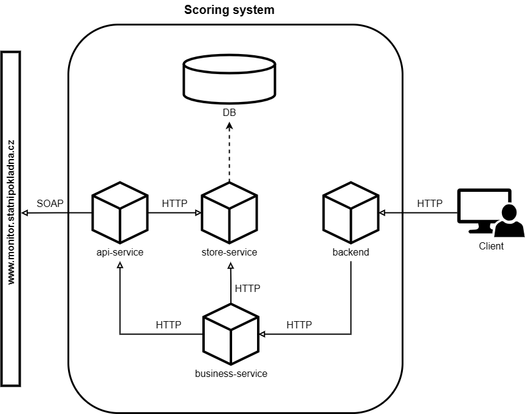

# Scoring system setup



## Prerequisites

- Docker: [Install Docker](https://docs.docker.com/get-docker/)

## Run

Execute the following command to start the system correctly. The individual services will then run on the localhost with the specified ports.

```docker-compose up```